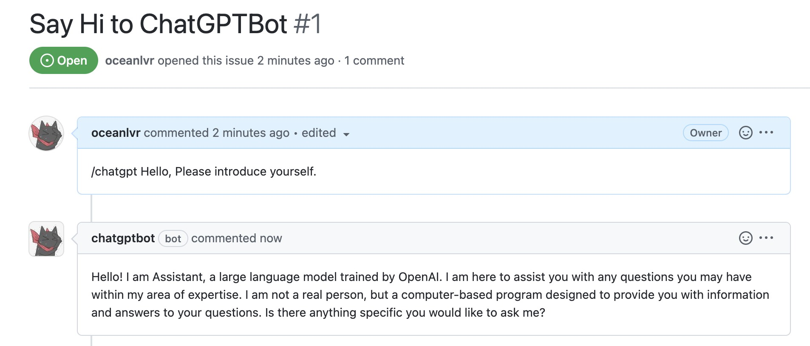
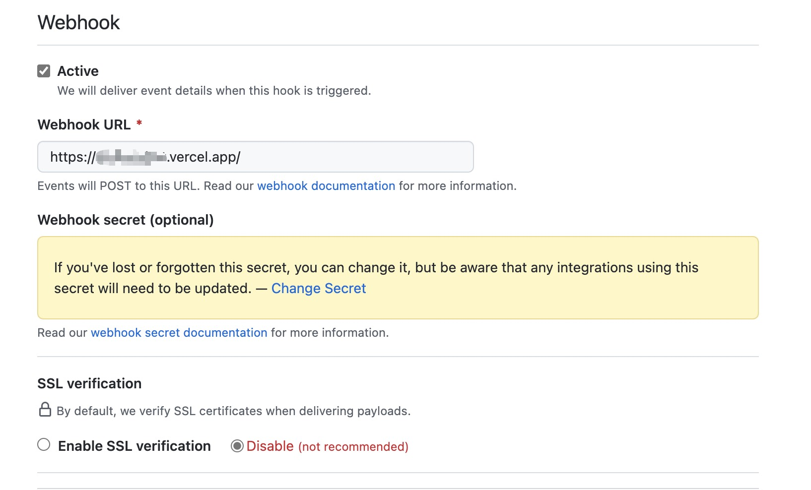

# ChatGPT ProBot

A ChatGPT-based GitHub APP. Type `/chatgpt` to chat with robot 🤖️



Powered by [Probot](https://github.com/probot/probot) & [chatgpt-api](https://github.com/transitive-bullshit/chatgpt-api)

## Deploy your own APP

[](https://vercel.com/new/clone?repository-url=https://github.com/oceanlvr/ChatGPTBot)

1. [Install & Configure the GitHub App](https://github.com/apps/chatgptbot)
2. Create `.env` file following `example.env`, please check config section in your [GitHub apps page](https://github.com/settings/apps)
    1. `APP_ID/PRIVATE_KEY/GITHUB_CLIENT_SECRET/GITHUB_CLIENT_ID` is required, please check [chatgptbot settings](https://github.com/settings/apps/chatgptbot) and fill them.
    2. **`PRIVATE_KEY` is required, it should be encoded by `base64`**.(`console.log(Buffer.from(<PRIVATE_KEY>).toString('base64'))`).
    3. `SESSION_TOKEN` is required, it is generated by `ChatGPT` [website](https://chat.openai.com/chat). You can get it following [this step](https://github.com/transitive-bullshit/chatgpt-api#how-it-works).
3. Vercel Deploy (**recommend**), click [](https://vercel.com/new/clone?repository-url=https://github.com/oceanlvr/ChatGPTBot) to clone deploy. Copy `.env` file environment to vercel app [environment-variables](https://vercel.com/docs/concepts/projects/environment-variables) in setting page (for me it's `https://vercel.com/oceanlvr/chatgptbot/settings/environment-variables`)
4. Edit the webhooks URL to your vercel app in your [vercel project setting page](https://github.com/settings/apps).
5. Type `/chatgpt` in an issue, chat with the bot

*step4: update webhook URL to your vercel app domain.*


## Dev

```sh
# Install dependencies
npm install

# Run the bot
npm dev
```

## License

[ISC](LICENSE) © 2022 oceanlvr
